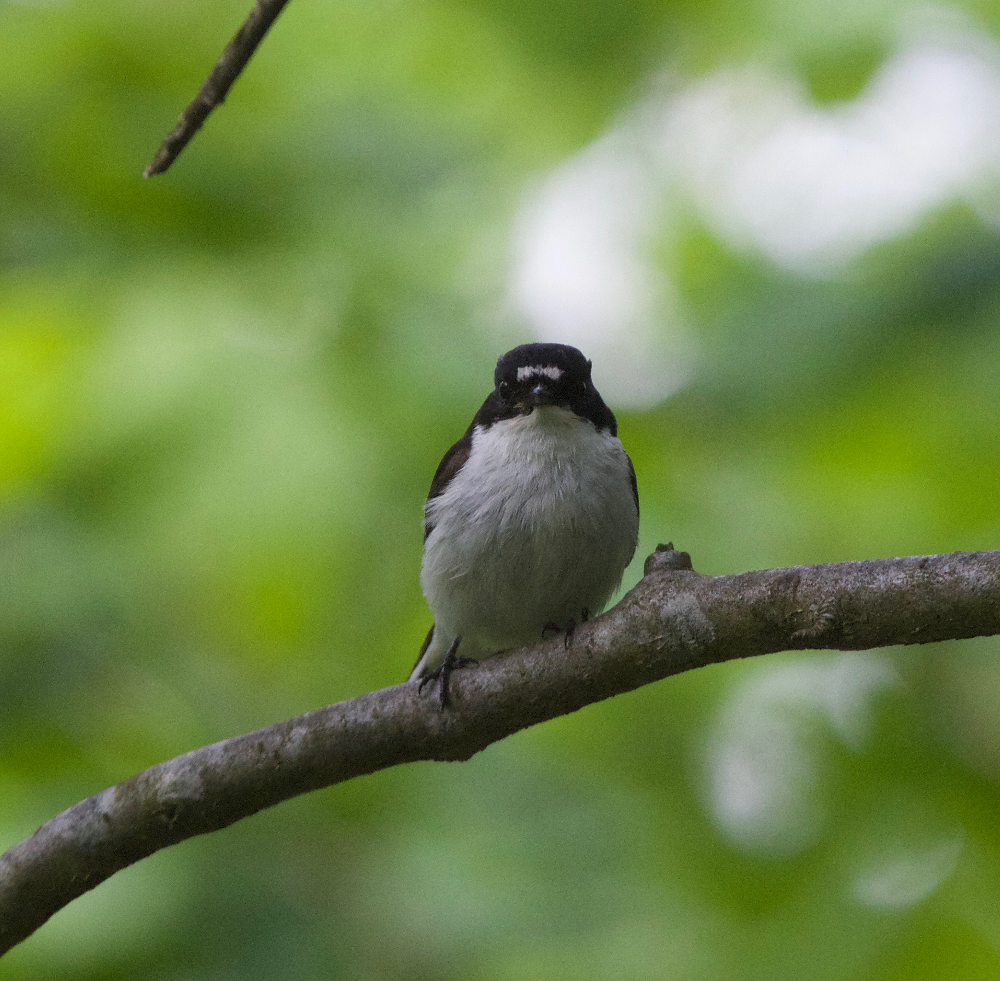

```{r setup, include=FALSE}
knitr::opts_chunk$set(echo = TRUE)
library(knitr)
```
### Red deer x Sika hybrids in Scotland

Red deer are a charismatic, economically important deer species that are characteristic of the Scottish wilderness. Sika are a Japanese deer species that was introduced to Scotland in the 19th century, resulting in hybridization between the two species.

```{r, echo=FALSE, out.width='40%', out.extra='style=float:right; padding:10px', fig.cap="photo courtesy of Ken McInnes", fig.topcaption=FALSE}
include_graphics("images/highland_red-sika_hybrid_KenMcInnes.jpg")
```

In collaboration with [Josephine Pemberton][JP], I have used high density markers to determine 1) which individuals are hybrid individuals [(McFarlane et al. 2020)][EvoApp], 2) how do they differ phenotypically from the parental species and 3) which regions of the genome are introgressing faster between species, as might be indicative of selection [(McFarlane et al. 2021)][MolEcol]? Additionally, we examined the use and benefits of high density markers in systems of anthropogenic hybridization, and suggested that backcrossing is likely underestimated in such systems [(McFarlane and Pemberton 2019)][TREE]. Finally, I use transcriptomics to differentiate gene expression between the species and understand allele specific expression. This transcriptomic work is in collaboration with Bengt Hansson at Lund University.

I am currently in the process of expanding this project to include European sympatric and hybridizing populations. If you're interested in collaborating (and if you want to explore whether the red deer or sika you work on are hybrids), please get [in touch][email]!

Work on the red deer - sika hybrid zone has been done by Josephine's group before my arrival. This is a well described system because of work by Helen Senn, Steph Smith and Darren Hunter, as well as many others.

### Collared and Pied flycatchers in Sweden

I did my PhD on the impact of metabolic rate as part of [Anna Qvarnström's lab][Anna] in the Department of Ecology and Genetics at Uppsala University. Collared and pied flycatchers are a model system of ecological speciation, where the extremely competitive collared flycatchers have displaced pied flycatchers into poor quality habitats. Additionally, these species regularly hybridize, allowing us to study the breakdown of prezygotic isolation at secondary contact.

```{r, echo=FALSE, out.width='30%', out.extra='style="float:right; padding:10px"'}
include_graphics("images/malecollared_prettybigpatch.jpg")
```
```{r, echo=FALSE, out.width='30%', out.extra='style="float:left; padding:10px"'}

```
I combined field experiments with long term monitoring data to ask 1) Does metabolic rate affect the competition dynamics between collared and pied flycatchers? and 2) does metabolic rate of hybrid individuals hint a genetic incompatibilities between these two species? My Phd Thesis “Speciation and Metabolic Rate: insights from an avian hybrid zone” is available here.

### Red Squirrels in Canada

My master’s and undergraduate research were done as part of [Andrew McAdam’s lab][Andrew] at the University of Guelph. I worked with the Kluane Red Squirrel project to ask about the evolutionary potential of this long term monitored population, using 'animal models' to estimate the heritability of fitness. A non-zero heritability of fitness is a prerequisite for adaptive evolution in a system. We found little evidence for additive genetic variance in fitness, but some evidence for maternal genetic effects, which would allow for evolution.


[EvoApp]:https://onlinelibrary.wiley.com/doi/pdf/10.1111/eva.12880
[MolEcol]:https://onlinelibrary.wiley.com/doi/pdf/10.1111/mec.15862
[TREE]:https://www.cell.com/trends/ecology-evolution/fulltext/S0169-5347(18)30305-7
[email]:eryn.mcfarlane@gmail.com
[Andrew]:http://www.mcadamlab.ca/
[JP]:https://pemberton.bio.ed.ac.uk/home
[Anna]:https://www.ieg.uu.se/animal-ecology/Research+groups/qvarnstrom-lab
