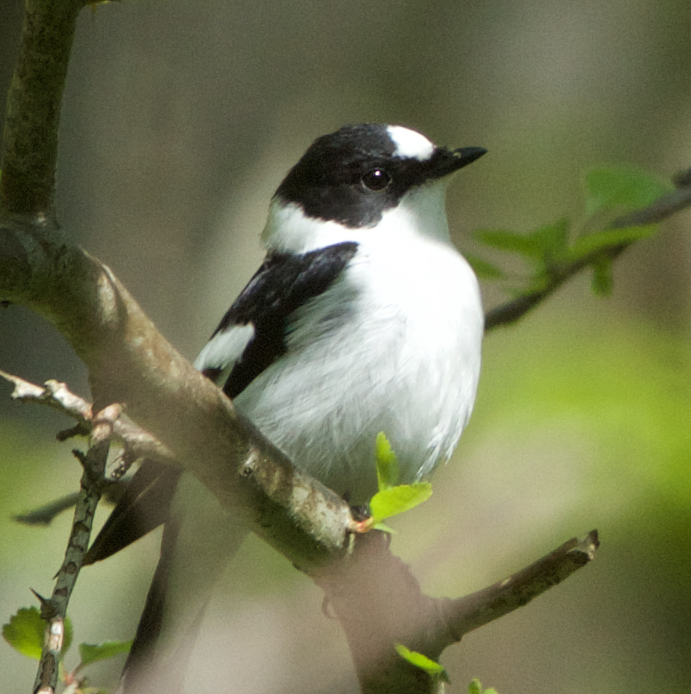
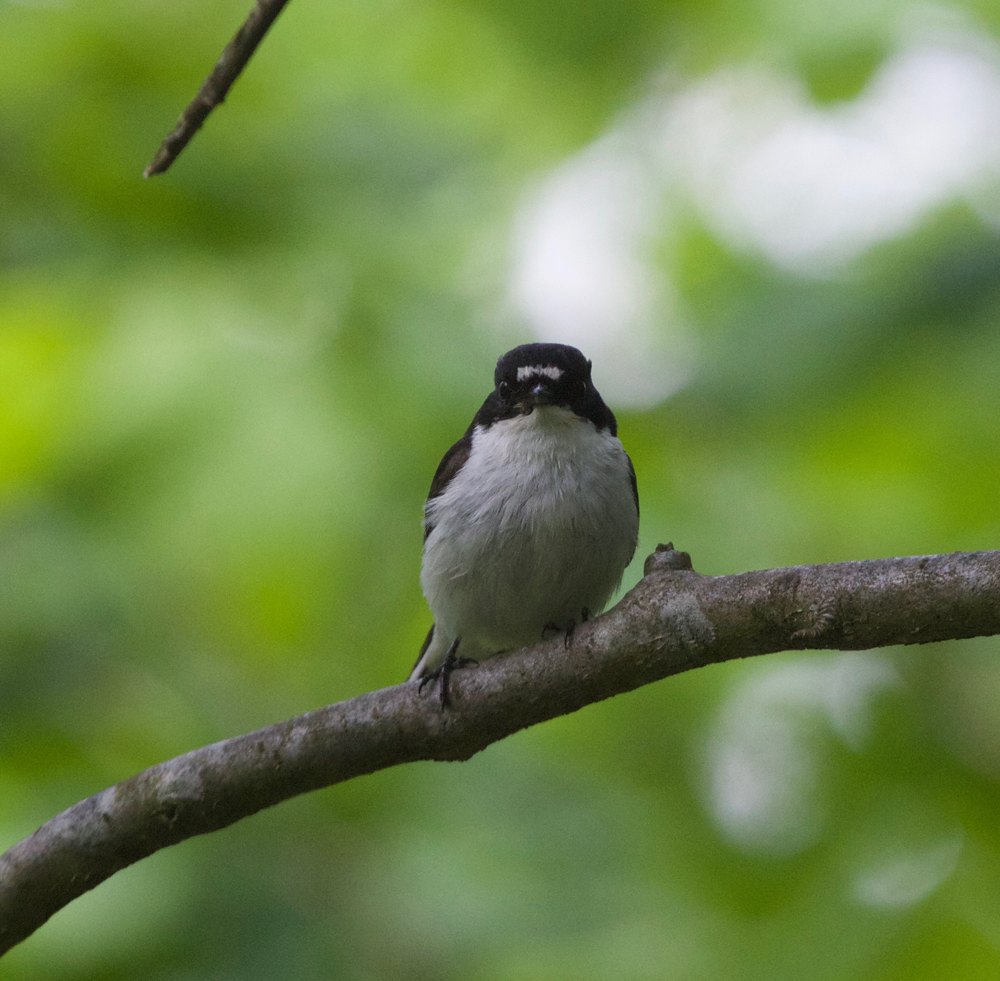

```{r setup, include=FALSE}
knitr::opts_chunk$set(echo = TRUE)
library(knitr)
```


### Our Lab

When two closely related species meet, there are a variety of different outcomes. They can compete with each other (competitive exclusion); they can change so that they don't compete (character displacement); and/or they can interbreed (hybridization). For each instance of this 'secondary contact', it's incredibly difficult to *predict* how likely each of these three options are, even between the same two species. This is really important because secondary contact is increasing with human influences on the world. We're bringing closely related species together, and we don't know what's going to happen. Don't panic. This is a delightfully interesting question to tangle with, which brings together field work, genetics, genomics, theory and statistics to answer. 

Much of the StatsGen Lab research centres on the question of predictability in evolutionary processes. Can we predict which species will hybridize, or how many hybrids will be in each population? How does environmental variation affect the outcomes at secondary contact? What can genomic data tell us predicting outcomes? What are our theoretical expectations of the process we think are occuring we can see, and how can we use the resulting patterns to infer processes in wild systems? 

We're a small but mighty group trying to address these questions that can be loosely sorted into three research themes. 

<Insert a lab picture here>

```{r, echo=FALSE, out.width='40%', out.extra='style=float:right; padding:10px', fig.cap="photo courtesy of Ken McInnes", fig.topcaption=FALSE}
include_graphics("images/highland_red-sika_hybrid_KenMcInnes.jpg")
```

### Variation Among Replicate Hybrid Zones

We expect that the number of hybrids in different hybrid zones can be different for reasons entirely due to chance [McFarlane et al. 2024]{https://onlinelibrary.wiley.com/doi/full/10.1111/mec.17359} 

```{r, echo=FALSE, out.width='30%', out.extra='style="float:right; padding:10px"'}

```
```{r, echo=FALSE, out.width='30%', out.extra='style="float:left; padding:10px"'}

```

### Predicting Evolutionary Outcomes

### Statistical Genetics Methods (respectfully, are we doing it wrong?)


